<div align="center">

# 🛡️ TelcoChurn-Guardian

### **Production ML Pipeline & Cost-Sensitive Churn Intelligence Engine**

[](https://www.python.org/)
[](https://scikit-learn.org/)
[](https://pandas.pydata.org/)
[](https://numpy.org/)
[](https://streamlit.io/)
[](https://opensource.org/licenses/MIT)

<p align="center">
  <b>Transforming telecom subscriber behavior data into actionable retention decisions through calibrated Logistic Regression, custom threshold tuning, and interactive Streamlit serving.</b>
</p>

---

</div>

## 📌 Executive Summary & Business Problem

In subscription-based telecommunications, customer retention is a primary driver of recurring profit. Acquiring a replacement subscriber costs **5× to 7× more** than retaining an existing one. 

Standard machine learning approaches blindly optimize for **Accuracy**, which yields ineffective results on imbalanced datasets (~26.6% churn rate). Furthermore, traditional models assume equal costs for all mistakes. In reality, business errors carry **asymmetric operational costs**:

| Error Type | What Happened | Real-World Impact | Financial Cost |
| :--- | :--- | :--- | :--- |
| **False Negative (FN)** | Model predicted **Stay**, but customer **Churned** | Customer is lost permanently without retention intervention | **~$500** (Lost Customer Lifetime Value) |
| **False Positive (FP)** | Model predicted **Churn**, but customer **Stayed** | Unnecessary retention discount or promo offer sent | **~$50** (Retention Incentive Cost) |

> [!IMPORTANT]
> Because a False Negative is **10× more expensive** than a False Positive, this project optimizes model decision boundaries directly against the **total operational loss curve**, reducing overall business losses rather than simply boosting statistical accuracy.

---

## 🏗️ System Architecture

```mermaid
flowchart LR
    A["Raw Data Ingestion<br><code>src/data_loader.py</code>"] --> B["Sanitization & Wrangling<br><code>src/cleaning.py</code>"]
    B --> C["Automated EDA Audit<br><code>src/eda.py</code>"]
    C --> D["Domain Feature Eng.<br><code>src/feature_engineering.py</code>"]
    D --> E["Stratified Split & Preprocessor<br><code>src/preprocessing.py</code>"]
    
    subgraph Core ["Notebook: Core Modeling Zone"]
        E --> F["Baseline & Training<br><code>LogisticRegression</code>"]
        F --> G["Probability & Metrics<br><code>predict_proba()</code>"]
        G --> H["Threshold & Cost Sweep<br><code>Cost Minimized at τ*</code>"]
        H --> I["Error Analysis & Odds Ratios<br><code>exp(w)</code>"]
        I --> J["Full Pipeline Export<br><code>.joblib Artifact</code>"]
    end
    
    J --> K["Streamlit App / Cloud Serving<br><code>app.py</code>"]
```



---

## 📁 Repository Structure

```text
telco-churn-guardian/
│
├── .streamlit/
│   └── config.toml               # Streamlit theme and UI configurations
│
├── data/
│   ├── raw/                      # Raw Telco CSV (automatically downloaded & cached)
│   └── processed/                # Processed intermediate data snapshots
│
├── src/                          # Modular Pre-Modeling Engines
│   ├── __init__.py               # Package marker
│   ├── data_loader.py            # Remote data acquisition & disk caching
│   ├── cleaning.py               # Missing value fixes, type coercion, identifier removal
│   ├── eda.py                    # Automated statistical profiling & correlation reporting
│   ├── feature_engineering.py    # Domain interaction features & tenure risk cohorts
│   └── preprocessing.py          # Leakage-free ColumnTransformer & Stratified Splitter
│
├── notebooks/
│   └── 01_telco_churn_modeling.ipynb  # Core interactive modeling, tuning & evaluation workspace
│
├── models/
│   └── telco_churn_pipeline.joblib    # Serialized end-to-end scikit-learn pipeline artifact
│
├── app.py                        # Interactive Streamlit customer risk dashboard
├── requirements.txt              # Production and modeling dependencies
├── .gitignore                    # Version control exclusion rules
└── README.md                     # Project documentation
```

---

## 🛠️ Tech Stack & Tooling

<div align="center">

| Layer | Technologies | Purpose |
| :--- | :--- | :--- |
| **Language** |  | Core programming runtime |
| **Data Processing** |   | Data manipulation, feature engineering, and vector math |
| **Machine Learning** |  | Regularized Logistic Regression, preprocessing, cross-validation |
| **Model Serialization** |  | Atomic pipeline persistence (`.joblib`) |
| **Visualization** |   | Cost curves, ROC-AUC, PR curves, and confusion matrices |
| **Serving & UI** |  | Interactive dashboard deployed on Streamlit Community Cloud |

</div>

---

## ⚙️ Engineering Workflow

### 1. Pre-Modeling Automation (`src/`)
Repetitive data hygiene, profiling, and transformation tasks are modularized into independent modules so you can verify each state transition without writing hundreds of lines of boilerplate:
* **`load_raw_data()`**: Ingests dataset from public IBM mirror if not locally cached.
* **`clean_data()`**: Sanitizes whitespace values in `TotalCharges` and maps target to `{0, 1}`.
* **`generate_eda_report()`**: Formats missing values, imbalance ratios, and target correlations.
* **`engineer_features()`**: Generates `Charge_Discrepancy`, `Total_Services_Subscribed`, and `Tenure_Cohort`.
* **`build_preprocessor()`**: Bundles numeric standard scaling and one-hot encoding into a scikit-learn `ColumnTransformer`.

### 2. Hands-on Modeling & Diagnostics (`notebooks/`)
All learning and machine learning decisions take place directly inside `01_telco_churn_modeling.ipynb`:
* **Naive Baseline**: `DummyClassifier` establishes the baseline metric floor.
* **Model Fitting**: Standard and balanced (`class_weight='balanced'`) Logistic Regression models.
* **Confidence Analysis**: Dissecting `predict()` vs. `predict_proba()`.
* **Comprehensive Metrics**: Precision, Recall, F1, ROC-AUC, PR-AUC, and Cross-Entropy Log Loss.
* **Cost Optimization**: Sweeping probability thresholds $\tau \in [0.05, 0.95]$ to minimize the $\$500 \cdot FN + \$50 \cdot FP$ loss function.
* **Error Analysis**: Systematic inspection of False Positives vs. False Negatives.
* **Model Explainability**: Computing Odds Ratios ($e^w$) for business interpretation.
* **Hyperparameter Tuning**: Cross-validated grid search (`GridSearchCV`) over $C$, penalty, and solver settings.
* **Pipeline Export**: Serializing the complete pipeline to `models/telco_churn_pipeline.joblib`.

### 3. Interactive Web Application (`app.py`)
A ready-to-run Streamlit application that consumes the serialized pipeline to provide:
* **Single Customer Profile Audit**: Interactive sliders and dropdowns to calculate real-time churn risk.
* **Dynamic Threshold Simulator**: Sliders to visualize how shifting risk thresholds changes customer flags and intervention budgets.
* **What-If Scenario Sandbox**: Live testing to see how changing contract terms or adding services lowers a customer's churn probability.

---

## 🚀 Quickstart Guide

### 1. Clone & Set Up Local Environment

```bash
# Clone repository
git clone https://github.com/<your-username>/telco-churn-guardian.git
cd telco-churn-guardian

# Initialize virtual environment
python -m venv venv

# Activate virtual environment
# Windows (PowerShell):
.\venv\Scripts\Activate.ps1
# macOS / Linux:
source venv/bin/activate

# Install dependencies
pip install -r requirements.txt
```

### 2. Run the Modeling Workspace

Launch JupyterLab to interactively step through the data preparation, modeling, and evaluation workflow:

```bash
jupyter lab notebooks/01_telco_churn_modeling.ipynb
```

### 3. Launch the Streamlit App

Once your notebook exports `models/telco_churn_pipeline.joblib`, launch the interactive dashboard:

```bash
streamlit run app.py
```

---

## ☁️ Deployment (Streamlit Community Cloud)

This repository is optimized for zero-configuration deployment to **Streamlit Community Cloud**:

1. Push your repository to GitHub (ensure `models/telco_churn_pipeline.joblib` is committed).
2. Visit [share.streamlit.io](https://share.streamlit.io/) and log in with your GitHub account.
3. Click **"New app"**, select your repository, set the branch to `main`, and specify the main file path as `app.py`.
4. Click **"Deploy"** to launch your live public application.

---

## 📜 License

This project is licensed under the [MIT License](LICENSE). Distributed for educational and portfolio demonstration purposes.
