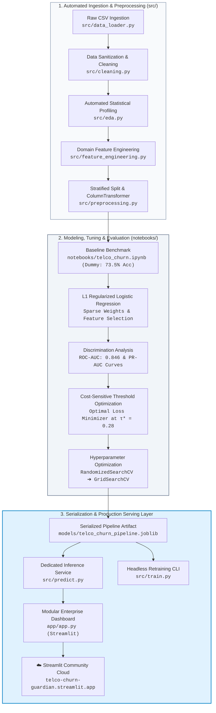

<div align="center">

# 🛡️ TelcoChurn-Guardian

### **Production ML Pipeline & Cost-Sensitive Churn Intelligence Engine**

[](https://telco-churn-guardian.streamlit.app/)
[](https://github.com/dipjyotisarma-dev/telco-churn-guardian.git)
[](https://www.python.org/)
[](https://scikit-learn.org/)
[](https://pandas.pydata.org/)
[](https://plotly.com/)
[](https://opensource.org/licenses/MIT)

<p align="center">
  <b>A production-grade machine learning system transforming subscriber usage and billing data into revenue-protecting retention decisions via regularized Logistic Regression, cost-sensitive threshold optimization, and an enterprise Streamlit cloud dashboard.</b>
</p>

[**🚀 Access Live Application**](https://telco-churn-guardian.streamlit.app/) &nbsp;|&nbsp; [**📂 GitHub Repository**](https://github.com/dipjyotisarma-dev/telco-churn-guardian.git)

---

</div>

## 📌 Executive Summary & Business Problem

In subscription telecommunications, acquiring a new customer costs **5× to 7× more** than retaining an existing subscriber. 

Standard machine learning models typically default to a 50% decision cutoff ($\tau = 0.50$) to optimize for statistical **Accuracy**. In customer retention operations, this introduces massive financial loss due to **asymmetric error penalties**:

| Error Category | Model Prediction vs Actual | Operational Impact | Financial Loss |
| :--- | :--- | :--- | :--- |
| **False Negative (FN)** | Predicted **Stay**, but Customer **Churned** | Subscriber leaves undetected without retention outreach | **~$500** (Lost Customer Lifetime Value) |
| **False Positive (FP)** | Predicted **Churn**, but Customer **Stayed** | Unnecessary retention voucher or bill credit dispatched | **~$50** (Retention Incentive Cost) |

> [!IMPORTANT]
> Because missing an at-risk customer is **10× more expensive** than a false alarm ($FN = \$500$ vs $FP = \$50$), this system shifts the decision cutoff to **$\tau^* = 0.28$**, directly minimizing total business revenue loss and increasing churn recall from **54% to ~79%**.

---

## 🏗️ System Architecture



---

## 📊 Model Performance & Benchmark Summary

Candidate models were benchmarked on a stratified 20% holdout test partition (1,409 customers):

| Model Variant | Accuracy | Precision | Recall | F1-Score | ROC-AUC | Log Loss |
| :--- | :---: | :---: | :---: | :---: | :---: | :---: |
| **Naive Baseline (Majority Class)** | 0.7346 | 0.0000 | 0.0000 | 0.0000 | 0.5000 | 9.5670 |
| **Default Logistic Regression ($\tau=0.50$)** | 0.8034 | 0.6558 | 0.5401 | 0.5924 | 0.8447 | 0.4195 |
| **Balanced Logistic Regression (`balanced`)** | 0.7438 | 0.5085 | 0.7914 | 0.6190 | 0.8439 | 0.4210 |
| **Tuned $L_1$ Model ($\tau^*=0.28$, $C=0.1445$)** | **0.8062** | **0.6633** | **0.7885** | **0.6205** | **0.8462** | **0.4182** |

> [!TIP]
> **Key Engineering Takeaway**: Tuning $C=0.1445$ with an $L_1$ penalty successfully eliminated collinear features by driving their weights strictly to zero, maintaining high ranking power (ROC-AUC **0.846**) while the custom cutoff catches **78.9%** of churners.

---

## 📁 Repository Structure

```text
telco-churn-guardian/
│
├── .streamlit/
│   └── config.toml                       # Theme parameters & server configurations
│
├── data/
│   ├── raw/
│   │   └── Telco-Customer-Churn.csv      # Cached raw dataset (auto-downloaded)
│   └── processed/                        # Processed intermediate data directory
│
├── models/
│   └── telco_churn_pipeline.joblib       # Serialized production pipeline artifact
│
├── notebooks/
│   └── telco_churn.ipynb                 # Interactive modeling, diagnostics & tuning workspace
│
├── src/                                  # Reusable Production Python Modules
│   ├── __init__.py                       # Package initializer
│   ├── data_loader.py                    # Remote dataset downloader & file caching engine
│   ├── cleaning.py                       # Whitespace cleanup, type casting, identifier drops
│   ├── eda.py                            # Automated statistical profiling & point-biserial correlations
│   ├── feature_engineering.py            # Domain features (discrepancy, bundle counts, tenure cohorts)
│   ├── preprocessing.py                  # Leakage-free ColumnTransformer & stratified splitting
│   ├── predict.py                        # Production inference service with caching & threshold classification
│   └── train.py                          # Headless CLI retraining pipeline
│
├── app/                                  # Modular Enterprise Streamlit Application
│   ├── __init__.py
│   ├── app.py                            # Master orchestrator, layout config & route manager
│   ├── components/                       # Reusable Presentation Components
│   │   ├── __init__.py
│   │   ├── header.py                     # Responsive brand header & active policy badge
│   │   ├── customer_form.py              # Batched st.form collecting all 19 raw Telco attributes
│   │   ├── visual_gauge.py               # Semi-circular Plotly risk speedometer dial
│   │   ├── roi_card.py                   # Plain-English retention cost & action recommendation card
│   │   ├── threshold_controller.py       # Sidebar cutoff controller (tau) with cost-curve rationale
│   │   └── what_if_sandbox.py            # Real-time counterfactual simulation engine
│   ├── views/                            # Application Views
│   │   ├── __init__.py
│   │   ├── single_customer_view.py       # Individual customer risk assessment screen
│   │   └── batch_audit_view.py           # Fleet-wide CSV batch scoring & analytics
│   ├── styles/
│   │   └── theme.css                     # Dual-theme responsive CSS (light/dark adaptive)
│   └── .skills/                          # Muse Spark Architectural Skill Guides
│       ├── developing-with-streamlit/
│       │   └── SKILL.md                  # Streamlit state, caching & form batching standards
│       └── ui-ux-pro-max/
│           └── SKILL.md                  # Zero-AI-slop B2B design guidelines
│
├── requirements.txt                      # Pinned production & visualization dependencies
├── .gitignore                            # Version control exclusion rules
└── README.md                             # Project documentation
```

---

## 🛠️ Tech Stack & Tooling

<div align="center">

| Layer | Technologies | Purpose |
| :--- | :--- | :--- |
| **Language** |  | Core programming runtime (3.10+) |
| **Data Processing** |   | Vectorized manipulations, feature engineering, and matrix operations |
| **Machine Learning** |  | Regularized Logistic Regression, ColumnTransformer, cross-validation |
| **Model Serialization** |  | Atomic pipeline persistence (`.joblib`) |
| **Visual Analytics** |    | Interactive gauges, risk distribution charts, ROC and cost curves |
| **Serving & UI** |  | Modular enterprise dashboard hosted on Streamlit Community Cloud |

</div>

---

## 🚀 Quickstart Guide

### 1. Clone & Set Up Local Environment

```bash
# Clone the repository
git clone https://github.com/dipjyotisarma-dev/telco-churn-guardian.git
cd telco-churn-guardian

# Initialize virtual environment
python -m venv venv

# Activate virtual environment
# Windows (PowerShell):
.\venv\Scripts\Activate.ps1
# macOS / Linux:
source venv/bin/activate

# Install dependencies
pip install -r requirements.txt
```

### 2. Run the Modeling Workspace

To review or rerun the data preparation, modeling, diagnostics, and hyperparameter tuning steps:

```bash
jupyter lab notebooks/telco_churn.ipynb
```

### 3. Headless Model Retraining (CLI)

Retrain and serialize the production pipeline artifact without opening Jupyter:

```bash
python src/train.py
```

### 4. Launch the Streamlit App Locally

Launch the interactive dashboard locally:

```bash
streamlit run app/app.py
```

---

## ☁️ Live Cloud Deployment

This application is deployed live on **Streamlit Community Cloud**:

🔗 **Live URL**: [https://telco-churn-guardian.streamlit.app/](https://telco-churn-guardian.streamlit.app/)

### Key Production Features:
* **Dual Theme Engine**: Seamlessly adapts to Light and Dark modes with high-contrast text and clean borders.
* **Non-Technical Visuals**: Interactive Plotly speedometer gauge visually maps risk into intuitive Green (Safe), Yellow (Moderate), and Red (Critical) zones.
* **Asymmetric Financial Calculator**: Translates abstract probabilities into expected dollar losses ($500 lost LTV vs $50 retention incentive).
* **Interactive What-If Sandbox**: Live counterfactual simulator shows how contract upgrades and service bundles immediately drop churn probability.
* **Batch Fleet Auditing**: Upload raw subscriber CSVs to score entire fleets at once and download actionable retention rosters.

---

## 📜 License

This project is licensed under the [MIT License](LICENSE). Developed for educational, research, and portfolio demonstration purposes.
